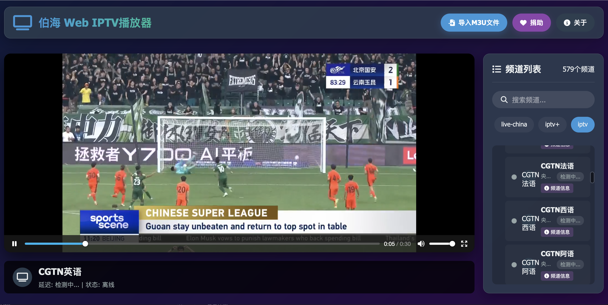
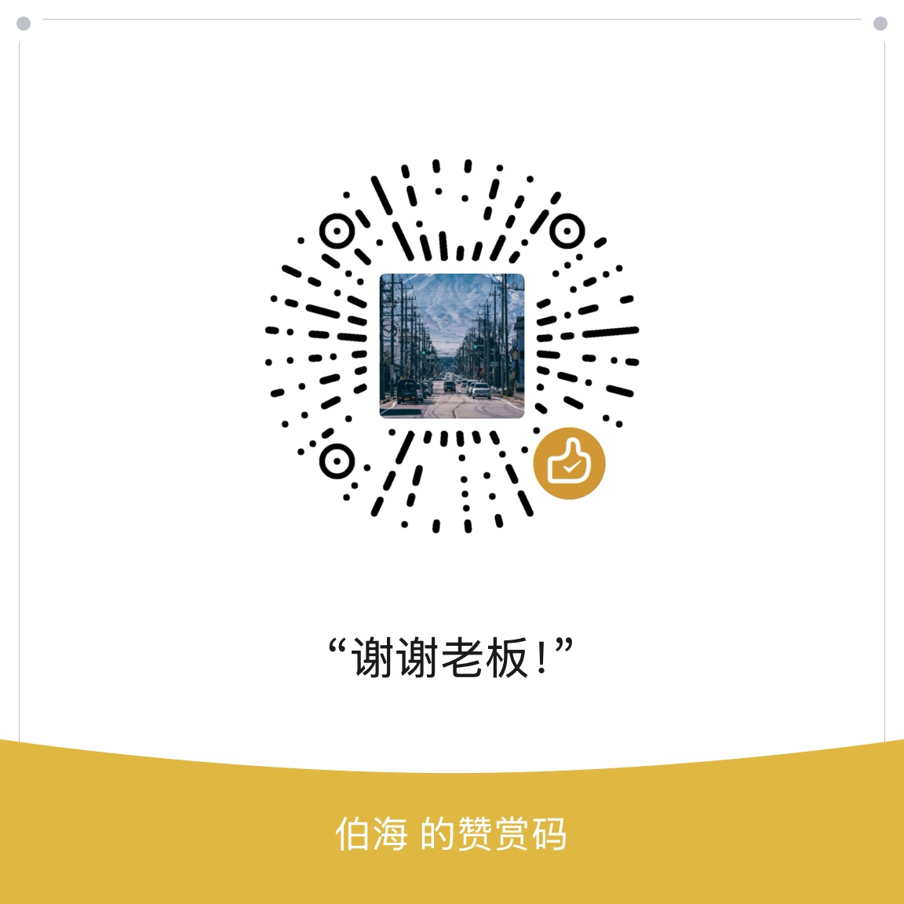

# 伯海 Web IPTV播放器



伯海 Web IPTV播放器是一个基于浏览器的IPTV直播解决方案，支持多种流媒体协议和操作方式，提供简洁直观的用户界面，让您轻松享受电视直播体验。

## 在线访问地址

| **环境** | **访问地址**                                   |
|----------|-----------------------------------------------|
| 国内访问  | [http://tv.boxtrade.top/](http://tv.boxtrade.top/) |
| 国外访问  | [http://iptv.boxtrade.top/](http://iptv.boxtrade.top/) |

## 主要功能

- **多协议支持**：支持HLS、MPEG-DASH、RTMP等主流流媒体协议
- **多操作方式**：完美适配鼠标、触屏和TV遥控器操作
- **频道管理**：支持多个M3U播放列表管理
- **智能分组**：自动按分类组织频道
- **频道检测**：实时检测频道可用性和延迟
- **全屏模式**：支持全屏播放及全屏控制
- **AI频道信息**：集成Gemini AI提供频道信息
- **跨平台**：兼容所有现代浏览器和设备

## IPTV源

本播放器默认使用来自 [kilvn/iptv](https://github.com/kilvn/iptv) 的优质直播源。您也可以导入自定义的M3U播放列表。

## 使用指南

### 1. 导入播放列表

1. 点击顶部菜单栏的"导入M3U文件"按钮
2. 选择本地的M3U文件或粘贴M3U URL
3. 播放列表将自动解析并显示在右侧频道列表区

### 2. 播放控制

- 在右侧频道列表中选择频道开始播放
- 使用播放器底部的控制按钮：
  - 上一个频道
  - 播放/暂停
  - 下一个频道
  - 音量控制
  - 全屏切换
- 点击"✨ 频道信息"按钮获取AI生成的频道详情

### 3. 全屏模式

- 双击播放器区域进入全屏模式
- 全屏模式下可使用控制栏切换频道
- 按ESC键或点击"退出全屏"按钮返回正常模式

### 4. 快捷键

| 按键          | 功能               |
|---------------|--------------------|
| 空格键        | 播放/暂停          |
| 左右方向键    | 切换频道           |
| F键           | 全屏切换           |
| ↑↓方向键      | 音量控制           |
| I键           | 获取频道信息       |

### 5. 频道信息获取

1. 选择任意频道
2. 点击频道项中的"✨ 频道信息"按钮
3. 系统将使用Gemini AI生成该频道的详细描述

## 项目结构

```
/iptv-player-web/
├── index.html         # 播放器主页面
├── style.css          # 页面样式表
├── script.js          # 核心功能脚本
├── iptv.m3u           # 【示例】频道列表文件
├── donate.jpg         # 捐助二维码图片
├── iptv_logo.png      # 播放器Logo
└── README.md          # 项目说明
```

## 捐助支持

如果您喜欢这个项目并希望支持开发者持续改进，欢迎扫码捐助：



您的支持将帮助我们：
- 持续维护和更新项目
- 添加新功能和改进
- 优化用户体验
- 提供更好的技术支持

支持方式：
- 微信/支付宝：扫描上方二维码
- PayPal：donate@example.com

感谢您的支持！❤️


---

### 📦 **项目源码托管**  
渤海Web IPTV采用双平台开源托管策略，同时维护以下两个代码仓库以适配不同开发者需求：  

| **平台**   | **仓库地址**                                      | **克隆命令**                              |
|------------|--------------------------------------------------|------------------------------------------|
| **Gitee**  | [https://gitee.com/czq1ac/bohaiwebiptv](https://gitee.com/czq1ac/bohaiwebiptv)  | `git clone https://gitee.com/czq1ac/bohaiwebiptv.git` |
| **GitHub** | [https://github.com/Eric007chen/bohaiwebiptv](https://github.com/Eric007chen/bohaiwebiptv) | `git clone https://github.com/Eric007chen/bohaiwebiptv.git` |

---

### ⚙️ **代码获取与协作方式**  
1. **直接克隆**  
   通过上述表格中的`git clone`命令将仓库下载至本地，支持后续的代码审查与二次开发。  

2. **仓库检索技巧**  
   - 在GitHub/Gitee搜索栏输入 `bohaiwebiptv` 可直接定位项目  

3. **协作开发建议**  
   若需贡献代码，推荐：  
   - **Fork仓库** → 本地修改 → 提交Pull Request  
   - 使用 **Issues** 模块报告问题或提议新功能  

---

### 🌐 **多平台适配说明**  
- **Gitee**：面向国内开发者，提供稳定的本地化访问及镜像同步  
- **GitHub**：覆盖国际开发者社区，便于全球化协作与持续集成（CI/CD）  
- 双仓库保持**定期同步**，确保代码一致性  


---


### 拉取子树更新
```bash
git subtree pull --prefix=m3u/kilvn  subtree-remote master --squash
```

### 多源更新
```bash
git remote set-url origin    https://gitee.com/czq1ac/bohaiwebiptv.git

git push


git remote set-url origin   https://github.com/Eric007chen/bohaiwebiptv.git


git push

```


## 捐助支持

如果您喜欢这个项目并希望支持开发者持续改进，欢迎扫码捐助：


您的支持将帮助我们：
- 持续维护和更新项目
- 添加新功能和改进
- 优化用户体验
- 提供更好的技术支持

支持方式：
- 微信/支付宝：扫描上方二维码
- PayPal：donate@example.com

感谢您的支持！❤️